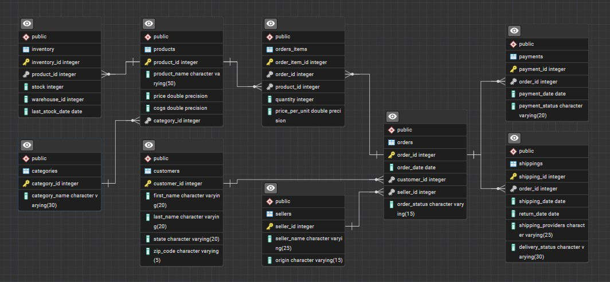

## Project Overview

**Project Title:** Amazon Advanced

**Resource**: [`02_business_queries.sql`](01_database_init.sql), [`01_database_init.sql`](02_business_queries.sql)


**Database:** `amazon_db`

The project involves setting up a retail sales database, performing exploratory data analysis (EDA), and answering specific business questions through SQL queries.

## Objectives

1. **Set up the Library Management System Database:** Create and populate the database with tables for branches, employees, members, books, issued status, and return status.
2. **CRUD Operations**: Perform Create, Read, Update, and Delete operations on the data.
3. **CTAS (Create Table As Select)**: Utilize CTAS to create new tables based on query results.
4. **Advanced SQL Queries**: Develop complex queries to analyze and retrieve specific data..

## Project Structure

### 1. Database Setup



- **Database Creation**: The project starts by creating a database named `library_db`.
- **Table Creation**: Created tables for branches, employees, members, books, issued status, and return status.

```sql
CREATE DATABASE library_db;

DROP TABLE IF EXISTS branch;

CREATE TABLE branch (
	branch_id VARCHAR(10) PRIMARY KEY,
	manager_id VARCHAR(10),
	branch_address VARCHAR(25),
	contact_no VARCHAR(15)
	
);

DROP TABLE IF EXISTS employees;

CREATE TABLE employees (
	emp_id VARCHAR(10) PRIMARY KEY,
	emp_name VARCHAR(40),
	emp_position VARCHAR(25),
	emp_salary DECIMAL(10,2),
	branch_id VARCHAR(10),
	FOREIGN KEY (branch_id) REFERENCES branch(branch_id)
);

DROP TABLE IF EXISTS books;
CREATE TABLE books(
	isbn VARCHAR(30) PRIMARY KEY,
	book_title VARCHAR(70),
	category VARCHAR(20),
	rental_price DECIMAL(10,2),
	status VARCHAR(5),
	author VARCHAR(60),
	publisher VARCHAR(50)
);

DROP TABLE IF EXISTS member;

CREATE TABLE member(
	member_id VARCHAR(10) PRIMARY KEY,
	member_name VARCHAR(30),
	member_address VARCHAR(50),
	reg_date DATE
);

DROP TABLE IF EXISTS return_status;

CREATE TABLE return_status(
	return_id VARCHAR(10) PRIMARY KEY,
	issued_id VARCHAR(10),
	return_book_name VARCHAR(75),
	return_date DATE,
	return_book_isbn VARCHAR(20)
);


DROP TABLE IF EXISTS issue_status;

CREATE TABLE issue_status (
	issue_id VARCHAR(10) PRIMARY KEY,
	issued_member_id VARCHAR(10),
	issued_book_name VARCHAR(100),
	issued_date DATE,
	issued_book_isbn VARCHAR(60),
	issued_emp_id VARCHAR(10)
);

--Foreign Keys

ALTER TABLE issue_status
ADD CONSTRAINT fk_member
FOREIGN KEY (issued_member_id)
REFERENCES member(member_id);

ALTER TABLE issue_status
ADD CONSTRAINT fk_book_isbn
FOREIGN KEY (issued_book_isbn)
REFERENCES books(isbn);

```

### 2. CRUD Operations

**Task 1.** Create a New Book Record 

```sql
INSERT INTO books 
(isbn,	book_title, category, rental_price, status, author, publisher)
VALUES
('978-1-60129-456-2', 'To Kill a Mockingbird', 'Classic', 6.00, 'yes', 'Harper Lee', 'J.B. Lippincott & Co.');
```
**Task 2.** Update an Existing Member's Address

```sql
UPDATE members
SET member_address = '125 Oak St'
WHERE member_id = 'C103';
```
**Task 3.** Delete a Record from the Issued Status

```sql
DELETE FROM issued_status
WHERE   issued_id =   'IS121';
```


### 3. CTAS (Create Table As Select) & Data Analysis

The following SQL queries were developed to answer specific business questions:

1. **Find Total Rental Income by Category**
```sql
SELECT 
	b.isbn,
	COUNT(i.issued_book_isbn) as times_sold,
	b.rental_price,
	COUNT(i.issued_book_isbn)*b.rental_price AS total_income
FROM books as b
JOIN issue_status as i
ON b.isbn = i.issued_book_isbn
GROUP BY b.isbn, b.rental_price;
```

2. **List Employees with Their Branch Manager's Name and their branch details:**:
```sql
SELECT 
	b.branch_id ,
	e.branch_id,
	b.manager_id,
	e2.emp_name as manager,
	e.emp_id,
	e.emp_name
FROM employees as e
JOIN branch as b
	ON e.branch_id = b.branch_id
JOIN employees as e2
	ON b.manager_id = e2.emp_id;
```

3. **Retrieve the List of Books Not Yet Returned**:
```sql
SELECT *
FROM return_status as r
RIGHT JOIN issue_status as i
	ON r.issued_id = i.issue_id
WHERE r.return_date IS NULL;
```

# Advanced Operations

4. **Identify Members with Overdue Books >30 days**:
```sql
SELECT 
	m.member_name,
	i.issued_book_name as book,
	i.issued_date,
	CURRENT_DATE - i.issued_date  as  days_overdue
FROM return_status as r
RIGHT JOIN issue_status as i
	ON r.issued_id = i.issue_id
JOIN member as m
	ON i.issued_member_id = m.member_id
WHERE r.return_date IS NULL 
	AND (CURRENT_DATE - i.issued_date) >= 50
ORDER BY days_overdue DESC;
```

5. **Update Book Status on Return**
   
The stored procedure should take the book_id as an input parameter. The procedure should first check if the book is available (status = 'yes'). If the book is available, it should be issued, and the status in the books table should be updated to 'no'. If the book is not available (status = 'no'), the procedure should return an error message indicating that the book is currently not available.:
```sql
CREATE OR REPLACE PROCEDURE 
	update_status
		(p_issued_id VARCHAR(10),
		p_issued_member_id VARCHAR(10),
		p_issued_book_id VARCHAR(60),
		p_issued_emp_id VARCHAR(10))
LANGUAGE plpgsql
as $$
	DECLARE
		var1 VARCHAR(10);
	BEGIN
		SELECT status INTO var1
		FROM books
		WHERE isbn = p_issued_book_id;

		IF  var1 = 'yes' 
		THEN
			INSERT INTO issue_status(issue_id,issued_member_id,issued_date,issued_book_isbn,issued_emp_id)
			VALUES (p_issued_id,p_issued_member_id,CURRENT_DATE,p_issued_book_id,p_issued_emp_id);

			UPDATE books
			SET status = 'no'
			WHERE isbn = p_issued_book_id;

			RAISE NOTICE 'Book success: %', p_issued_book_id;
			
		ELSE
			RAISE NOTICE 'Book failure: %', p_issued_book_id;
			
		end if;

	END;

$$
```

```sql
CALL update_status('RS138', 'IS135', 'Good');
```

6. **Branch Performance Report**
   
Create a query that generates a performance report for each branch, showing the number of books issued, the number of books returned, and the total revenue generated from book rentals.:

```sql
SELECT 
	br.branch_id,
	COUNT(i.issue_id),
	COUNT(r.return_id),
	SUM(b.rental_price)
FROM issue_status as i
JOIN employees as e
	ON i.issued_emp_id = e.emp_id
JOIN branch as br
	ON br.branch_id = e.branch_id
LEFT JOIN return_status as r
	ON r.issued_id = i.issue_id
JOIN books as b
	ON b.isbn = i.issued_book_isbn
GROUP BY br.branch_id;
```
